<p align="center">
  
</p>

<h1 align="center">Nuclei Command Center</h1>

<p align="center">
  <strong>Enterprise-Grade Vulnerability Management Dashboard</strong>
</p>

<p align="center">
  <a href="#features">Features</a> •
  <a href="#architecture">Architecture</a> •
  <a href="#installation">Installation</a> •
  <a href="#security">Security</a> •
  <a href="#documentation">Documentation</a>
</p>

<p align="center">
  
  
  
  
  
</p>

---

## Overview

**Nuclei Command Center (NUCLEI_CNM)** is a production-ready, security-hardened web interface for orchestrating vulnerability assessments using [ProjectDiscovery's Nuclei](https://github.com/projectdiscovery/nuclei) scanner. Built by security professionals for security professionals, it transforms raw Nuclei output into actionable intelligence through a modern, authenticated dashboard.

### Why Nuclei Command Center?

| Challenge | Solution |
|-----------|----------|
| CLI-only workflow slows down operations | **One-click preset scans** with configurable parameters |
| Findings scattered across JSON files | **Centralized SQLite database** with full-text search |
| No vulnerability lifecycle tracking | **Status management**: New → Confirmed → Fixed → Closed |
| Team collaboration is difficult | **Import/Export** capabilities with backup & restore |
| No access control for scan operations | **NextAuth v5 integration** with bcrypt password hashing |

---

## Screenshots

### 🔐 Authentication

<p align="center">
  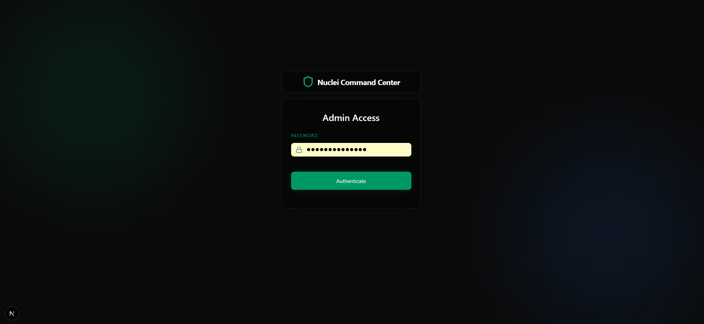
  <br/>
  <em>Secure login with bcrypt-hashed credentials</em>
</p>

---

### 📊 Dashboard & Monitoring

<p align="center">
  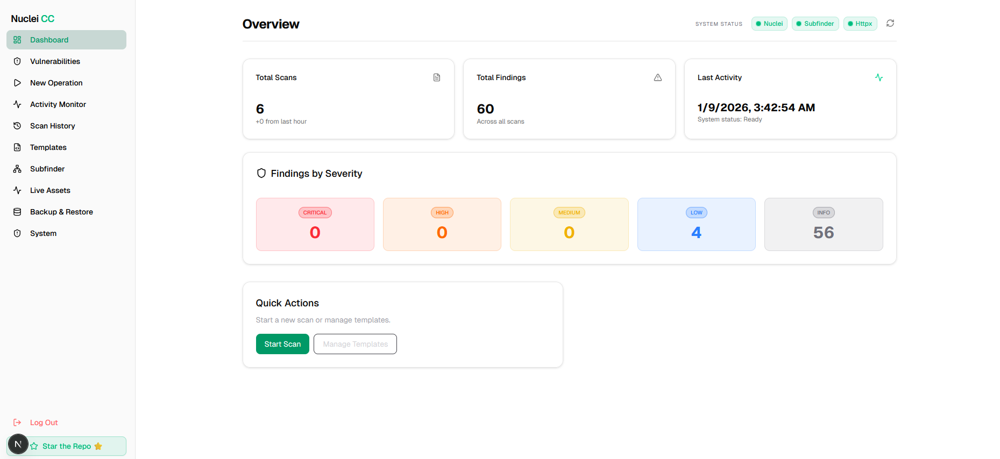
  <br/>
  <em>Real-time overview with vulnerability statistics and recent findings</em>
</p>

<p align="center">
  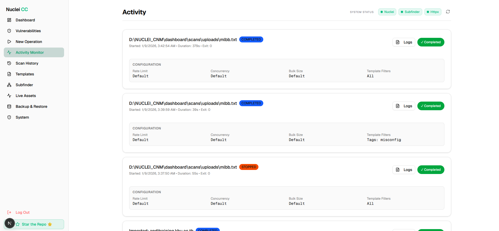
  <br/>
  <em>Live scan activity tracking with process management</em>
</p>

---

### 🎯 Vulnerability Scanning

| Nuclei Scanner | Scan History |
|:--------------:|:------------:|
| 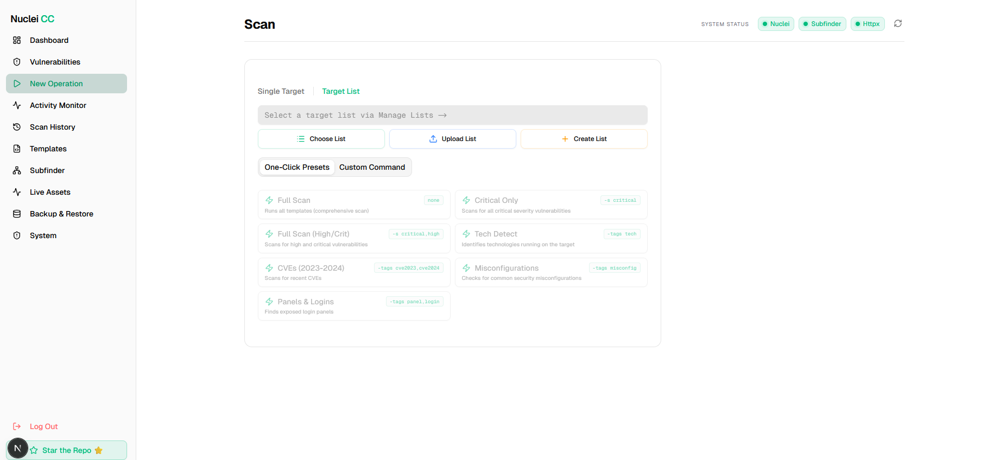 | 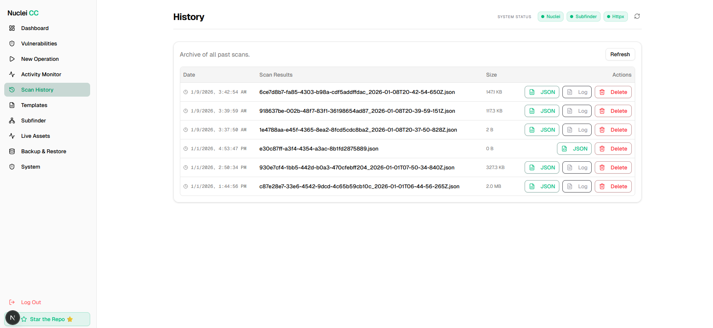 |
| *Configure and launch Nuclei scans* | *View all past scan results* |

<p align="center">
  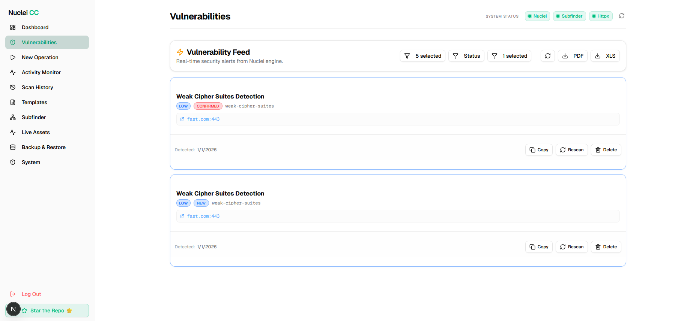
  <br/>
  <em>Detailed vulnerability findings with severity classification</em>
</p>

---

### 🌐 Subdomain Discovery (Subfinder)

| Subdomain Scan | Inventory View |
|:--------------:|:--------------:|
| 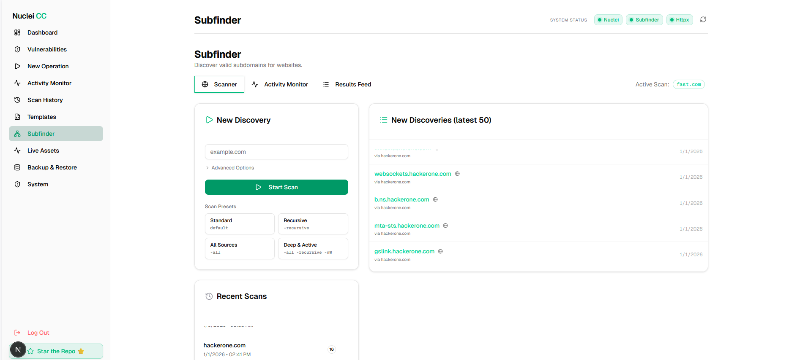 | 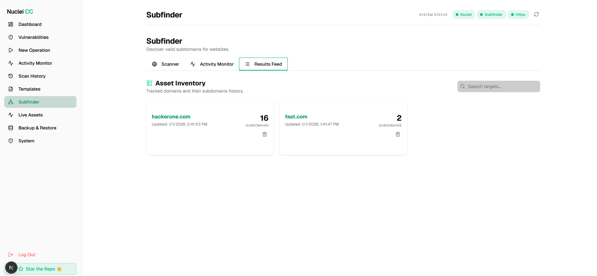 |
| *Launch subdomain enumeration* | *Browse discovered subdomains* |

<p align="center">
  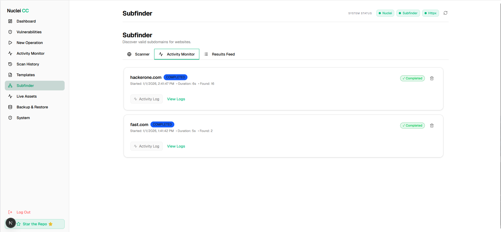
  <br/>
  <em>Monitor subdomain discovery progress</em>
</p>

---

### 🔍 HTTP Probing (HTTPX)

| HTTPX Scan | HTTPX Results |
|:----------:|:-------------:|
| 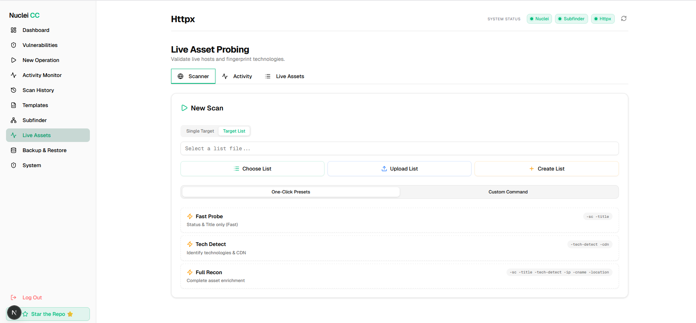 |  |
| *Configure HTTP probing parameters* | *View live host analysis results* |

---

### ⚙️ System Administration

| System Settings | Scanner Management |
|:---------------:|:------------------:|
| 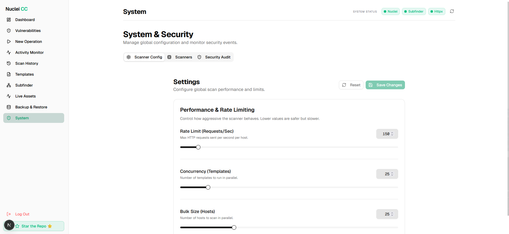 | 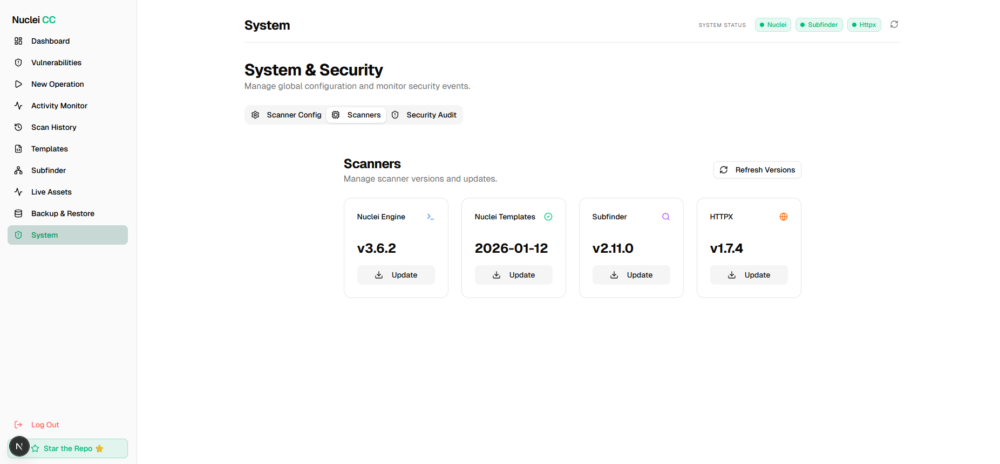 |
| *Configure rate limits and performance* | *Manage scanner binaries* |

| Login Records | Backup & Restore |
|:-------------:|:----------------:|
| 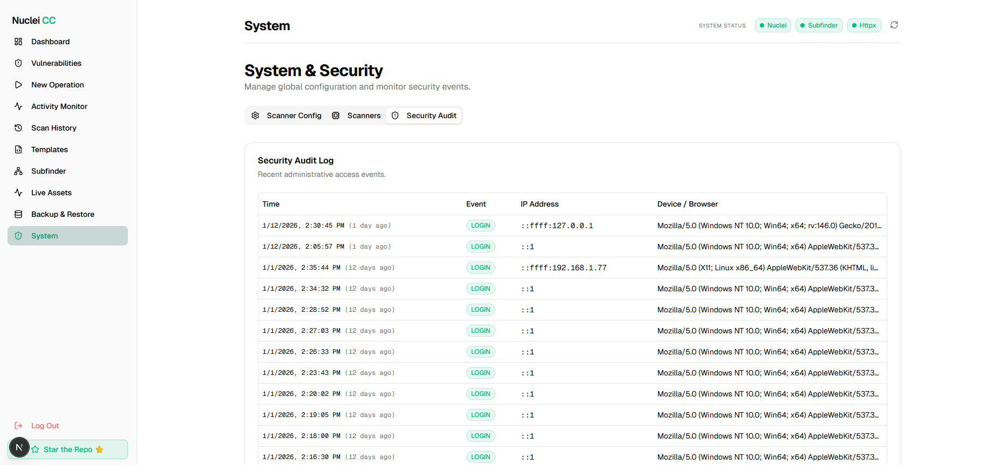 | 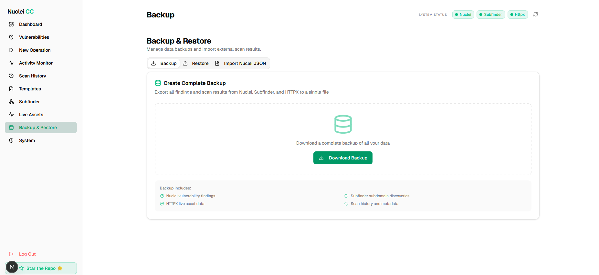 |
| *Audit authentication events* | *Export and restore all data* |

<p align="center">
  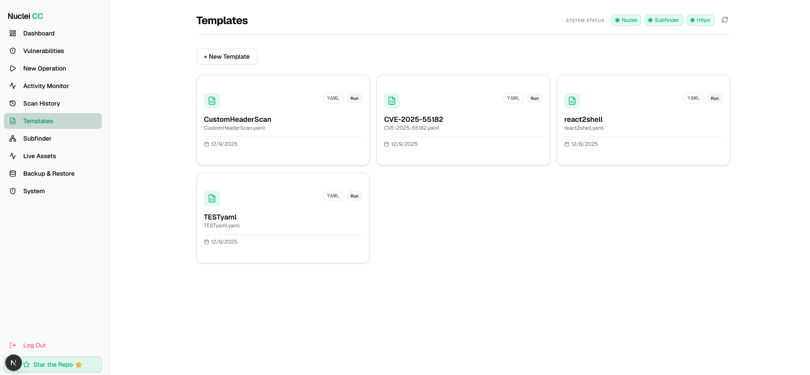
  <br/>
  <em>Create and manage custom Nuclei templates</em>
</p>

---

## Features

### 🎯 Vulnerability Management

- **Unified Finding Feed**: Aggregate all scan results in a single, filterable interface
- **Severity Classification**: Color-coded Critical/High/Medium/Low/Info badges
- **Status Workflow**: Track findings through New → Confirmed → False Positive → Fixed → Closed
- **Surgical Rescan**: Re-verify individual vulnerabilities with one click
- **Bulk Export**: CSV exports filtered by severity level

### ⚡ Scan Operations

- **7 Pre-Configured Presets**:
  | Preset | Nuclei Flags | Use Case |
  |--------|--------------|----------|
  | Full Scan | None | Comprehensive assessment |
  | Critical Only | `-s critical` | High-priority triage |
  | High & Critical | `-s critical,high` | Risk-focused scan |
  | Technology Detection | `-tags tech` | Asset fingerprinting |
  | Recent CVEs | `-tags cve2023,cve2024` | Patch verification |
  | Misconfigurations | `-tags misconfig` | Security hardening |
  | Admin Panels | `-tags panel,login` | Exposed interface detection |

- **Custom Command Builder**: Full CLI flag support for advanced operators
- **Real-time Activity Monitor**: Live scan status with duration tracking
- **Background Processing**: Non-blocking scan execution with process management

### 🔧 System Management

- **Engine Updates**: One-click updates for Nuclei, Subfinder, and HTTPX binaries
- **Template Management**: Create, edit, and execute custom YAML templates
- **Performance Tuning**: Configurable rate limits, concurrency, and bulk sizes
- **Access Logging**: Audit trail for authentication events

### 💾 Data Management

- **SQLite Persistence**: Indexed database with foreign key relationships
- **Full Backup**: Export all scanners' data (Nuclei, Subfinder, HTTPX) to JSON
- **Transaction-Safe Restore**: Atomic restore with rollback on failure
- **External Import**: Ingest Nuclei JSON from CI/CD pipelines or other sources

---

## Architecture

```
┌─────────────────────────────────────────────────────────────────────────┐
│                           NUCLEI COMMAND CENTER                         │
├─────────────────────────────────────────────────────────────────────────┤
│                                                                         │
│  ┌─────────────┐    ┌─────────────┐    ┌─────────────┐                 │
│  │   Browser   │───▶│  proxy.ts   │───▶│  Next.js    │                 │
│  │   Client    │    │ (Middleware)│    │  App Router │                 │
│  └─────────────┘    └─────────────┘    └─────────────┘                 │
│         │                  │                  │                         │
│         │           ┌──────▼──────┐          │                         │
│         │           │  NextAuth   │          │                         │
│         │           │  Sessions   │          │                         │
│         │           └─────────────┘          │                         │
│         │                                    │                         │
│         │           ┌────────────────────────▼─────────────────────┐   │
│         │           │              API Routes (/api/*)              │   │
│         │           │  ┌─────────┐ ┌─────────┐ ┌─────────────────┐ │   │
│         │           │  │  scan   │ │findings │ │ system/scanners │ │   │
│         │           │  └────┬────┘ └────┬────┘ └────────┬────────┘ │   │
│         │           └───────┼───────────┼───────────────┼──────────┘   │
│         │                   │           │               │              │
│  ┌──────▼──────┐     ┌──────▼───────────▼───────────────▼──────┐       │
│  │    React    │     │              SQLite Database             │       │
│  │  Components │     │  ┌────────┐  ┌──────────┐  ┌─────────┐  │       │
│  └─────────────┘     │  │ scans  │  │ findings │  │ access  │  │       │
│                      │  │        │  │          │  │  logs   │  │       │
│                      │  └────────┘  └──────────┘  └─────────┘  │       │
│                      └─────────────────────────────────────────┘       │
│                                        │                               │
│                               ┌────────▼────────┐                      │
│                               │  Nuclei Binary  │                      │
│                               │   (System PATH) │                      │
│                               └─────────────────┘                      │
│                                                                         │
└─────────────────────────────────────────────────────────────────────────┘
```

### Technology Stack

| Layer | Technology | Purpose |
|-------|------------|---------|
| **Frontend** | Next.js 15, React 19, Tailwind CSS | Server-side rendering, responsive UI |
| **Components** | shadcn/ui (Radix primitives) | Accessible, customizable UI library |
| **Authentication** | Auth.js v5 (NextAuth) | Session management, middleware protection |
| **Password Security** | bcrypt (10 rounds) | Secure credential hashing |
| **Database** | SQLite + better-sqlite3 | Embedded, zero-config persistence |
| **API** | Next.js Route Handlers | RESTful endpoints with type safety |
| **Process Mgmt** | Node.js child_process | Nuclei binary execution |
| **Caching** | In-memory TTL cache | Reduced database load |

---

## Installation

### Prerequisites

| Requirement | Version | Verification |
|-------------|---------|--------------|
| Node.js | ≥ 18.0.0 | `node --version` |
| npm | ≥ 9.0.0 | `npm --version` |
| Go | ≥ 1.21 | `go version` |
| Nuclei | ≥ 3.6.0 | `nuclei -version` |

### Step 1: Install ProjectDiscovery Tools

```bash
# Install Nuclei
go install -v github.com/projectdiscovery/nuclei/v3/cmd/nuclei@latest

# Install Subfinder (optional, for subdomain discovery)
go install -v github.com/projectdiscovery/subfinder/v2/cmd/subfinder@latest

# Install HTTPX (optional, for HTTP probing)
go install -v github.com/projectdiscovery/httpx/cmd/httpx@latest

# Ensure Go bin is in PATH
# Windows: Add %USERPROFILE%\go\bin to PATH
# Linux/macOS: export PATH=$PATH:$(go env GOPATH)/bin
```

### Step 2: Clone and Install

```bash
git clone https://github.com/yourusername/NUCLEI_CNM.git
cd NUCLEI_CNM/dashboard
npm install
```

### Step 3: Configure Authentication

Generate a secure password hash:

```bash
# Using Node.js
node -e "const bcrypt = require('bcrypt'); bcrypt.hash('YOUR_SECURE_PASSWORD', 10).then(h => console.log(h));"
```

Generate an auth secret:

```bash
# Using OpenSSL
openssl rand -base64 32

# Or using Node.js
node -e "console.log(require('crypto').randomBytes(32).toString('base64'))"
```

Create `dashboard/.env.local`:

```env
# Required: Bcrypt hash of your admin password
ADMIN_PASSWORD_HASH="$2b$10$XXXXXXXXXXXXXXXXXXXXXXXXXXXXXXXXXXXXXXXXXXXXXXXXXXXX"

# Required: Random secret for session signing (32+ characters)
AUTH_SECRET="XXXXXXXXXXXXXXXXXXXXXXXXXXXXXXXXXXXXXXXX"
```

### Step 4: Initialize and Run

```bash
# Development mode (with hot reload)
npm run dev

# Production build
npm run build
npm start
```

Access the dashboard at **http://localhost:3000**

---

## 🐳 Docker Deployment

The easiest way to run Nuclei Command Center with all tools pre-installed.

[](https://hub.docker.com/r/mrtintnaingwin/nucleicnm)

### Quick Start

```bash
# Pull and run (PowerShell)
docker run -d `
  --name nuclei-cnm `
  -p 3000:3000 `
  -v ${PWD}/data:/app/data `
  -v ${PWD}/scans:/app/scans `
  mrtintnaingwin/nucleicnm:latest
```

On first visit to `http://localhost:3000`, you'll be redirected to a setup wizard to create your admin password. **No manual hash generation required!**

### Docker Compose (Recommended)

Create `docker-compose.yml`:

```yaml
services:
  nuclei-cnm:
    image: mrtintnaingwin/nucleicnm:latest
    container_name: nuclei-command-center
    ports:
      - "3000:3000"
    volumes:
      - ./data:/app/data          # Database & config (REQUIRED)
      - ./scans:/app/scans        # Scan results
      - nuclei-templates:/home/nextjs/nuclei-templates
    environment:
      # Optional: Override allowed origins for remote access
      - ALLOWED_ORIGINS=localhost:3000,your-server.local:3000
    restart: unless-stopped
    healthcheck:
      test: ["CMD", "wget", "-q", "--spider", "http://localhost:3000/login"]
      interval: 30s
      timeout: 10s
      retries: 3

volumes:
  nuclei-templates:
```

```bash
# Start the container
docker-compose up -d

# View logs
docker-compose logs -f
```

### Build from Source (Alternative)

```bash
git clone https://github.com/devtint/NUCLEI_CNM.git
cd NUCLEI_CNM/dashboard
docker build -t nuclei-cnm:latest .

# Run
docker run -d -p 3000:3000 -v ${PWD}/data:/app/data nuclei-cnm:latest
```

### Docker Environment Variables

| Variable | Required | Default | Description |
|----------|----------|---------|-------------|
| `AUTH_TRUST_HOST` | ❌ | `true` | Fixes "UntrustedHost" error (auto-set in container) |
| `ALLOWED_ORIGINS` | ❌ | `localhost:3000` | Comma-separated list of allowed origins |
| `ALLOWED_DEV_ORIGINS` | ❌ | - | Development origins (no port needed) |
| `DATABASE_PATH` | ❌ | `/app/data/nuclei.db` | Custom database location |

> **Note**: Password and AUTH_SECRET are configured via the first-run setup wizard and stored in `/app/data/config.json`. No environment variables needed!

### Troubleshooting

**Error: `[auth][error] UntrustedHost: Host must be trusted`**
- This happens if you are running behind a reverse proxy or non-standard port.
- **Fix:** Set `AUTH_TRUST_HOST=true` or set `AUTH_URL=http://your-domain.com`.
- **Note:** The `nuclei-cnm:latest` image sets `AUTH_TRUST_HOST=true` by default.

### Pre-installed Tools

The Docker image includes:
- **Nuclei** v3.6.2+
- **Subfinder** v2.12.0+
- **HTTPX** v1.8.1+

All tools are automatically available - no additional configuration required.

---

## Security

### Authentication Architecture

```
┌──────────────────────────────────────────────────────────────┐
│                    Security Layers                           │
├──────────────────────────────────────────────────────────────┤
│                                                              │
│  Layer 1: Edge Middleware (proxy.ts)                        │
│  ├─ Intercepts ALL requests before routing                  │
│  ├─ Validates session existence                             │
│  ├─ Redirects unauthenticated users to /login               │
│  └─ Enforces HTTPS in production                            │
│                                                              │
│  Layer 2: API Route Guards                                   │
│  ├─ Every API handler calls await auth()                    │
│  ├─ Returns 401 Unauthorized if no session                  │
│  └─ Prevents direct API access bypass                       │
│                                                              │
│  Layer 3: Password Security                                  │
│  ├─ Bcrypt hashing with 10 salt rounds                      │
│  ├─ Timing-safe comparison                                  │
│  └─ No plaintext password storage                           │
│                                                              │
│  Layer 4: Session Management                                 │
│  ├─ Secure HTTP-only cookies                                │
│  ├─ CSRF protection (built-in)                              │
│  └─ Configurable session lifetime                           │
│                                                              │
└──────────────────────────────────────────────────────────────┘
```

### Security Best Practices

| Practice | Implementation |
|----------|----------------|
| **Secrets Management** | All secrets in `.env.local` (gitignored) |
| **Password Policy** | Minimum 12 characters recommended |
| **SQL Injection** | Prepared statements via better-sqlite3 |
| **XSS Prevention** | React's built-in escaping + CSP headers |
| **CSRF Protection** | NextAuth automatic token validation |
| **Access Logging** | Authentication events logged to database |
| **Sensitive Data** | Database and scan results excluded from Git |

### Protected Resources

| Resource | Protection Method |
|----------|-------------------|
| `/` (Dashboard) | Middleware redirect |
| `/vulnerabilities` | Middleware redirect |
| `/api/scan` | 401 if no session |
| `/api/findings` | 401 if no session |
| `/api/backup/*` | 401 if no session |
| `/api/system/*` | 401 if no session |

---

## Configuration

### Environment Variables

#### Local Development

| Variable | Required | Description |
|----------|----------|-------------|
| `ADMIN_PASSWORD_HASH` | ✅ | Bcrypt hash of admin password |
| `AUTH_SECRET` | ✅ | Session signing secret (32+ chars) |
| `NODE_ENV` | ❌ | `development` or `production` |
| `ALLOWED_ORIGINS` | ❌ | Comma-separated allowed origins (default: `localhost:3000`) |
| `NUCLEI_BINARY` | ❌ | Custom path to Nuclei binary (auto-detected via PATH) |
| `SUBFINDER_BINARY` | ❌ | Custom path to Subfinder binary (auto-detected via PATH) |
| `HTTPX_BINARY` | ❌ | Custom path to HTTPX binary (auto-detected via PATH) |

#### Docker Deployment

| Variable | Required | Description |
|----------|----------|-------------|
| `ADMIN_PASSWORD_HASH` | ❌ | **Auto-configured via setup wizard** |
| `AUTH_SECRET` | ❌ | **Auto-generated via setup wizard** |
| `ALLOWED_ORIGINS` | ❌ | Override for remote access |
| `DATABASE_PATH` | ❌ | Custom database location (default: `/app/data/nuclei.db`) |

> **Docker Note**: Password and auth secret are configured via the first-run setup wizard. No manual bcrypt hash generation required!

### Performance Tuning

Located in **Settings** within the dashboard:

| Setting | Default | Range | Impact |
|---------|---------|-------|--------|
| Rate Limit | 150 req/s | 50-1000 | Target server load |
| Concurrency | 25 | 25-300 | Parallel template execution |
| Bulk Size | 25 | 25-100 | Hosts per batch |

---

## Project Structure

```
NUCLEI_CNM/
├── dashboard/                          # Next.js Application
│   ├── app/                            # App Router
│   │   ├── api/                        # Backend API Routes
│   │   │   ├── auth/                   # NextAuth endpoints
│   │   │   ├── scan/                   # Scan CRUD operations
│   │   │   ├── findings/               # Finding management
│   │   │   ├── backup/                 # Export/restore
│   │   │   └── system/                 # Engine updates, health
│   │   ├── login/                      # Authentication page
│   │   └── page.tsx                    # Main dashboard
│   ├── components/                     # React Components
│   │   ├── dashboard/                  # Overview, stats
│   │   ├── findings/                   # Table, filters
│   │   ├── scan/                       # Wizard, console
│   │   └── ui/                         # shadcn/ui primitives
│   ├── lib/                            # Core Logic
│   │   ├── db.ts                       # Database operations
│   │   ├── cache.ts                    # TTL caching
│   │   ├── env.ts                      # Environment handling
│   │   └── nuclei/                     # Config, presets
│   ├── proxy.ts                        # Authentication middleware
│   ├── auth.ts                         # Credentials provider
│   ├── auth.config.ts                  # NextAuth config
│   └── scans/                          # Scan output (gitignored)
├── Refrencce and Usage And Guide/      # Technical Documentation
│   ├── GETTING_STARTED.md
│   ├── AUTHENTICATION.md
│   ├── ARCHITECTURE.md
│   ├── API_REFERENCE.md
│   ├── FEATURES.md
│   └── COMPONENTS.md
├── .gitignore                          # Security-conscious ignores
└── README.md                           # This file
```

---

## Documentation

| Document | Description |
|----------|-------------|
| [GETTING_STARTED.md](./Refrencce%20and%20Usage%20And%20Guide/GETTING_STARTED.md) | Complete setup and first scan guide |
| [AUTHENTICATION.md](./Refrencce%20and%20Usage%20And%20Guide/AUTHENTICATION.md) | Security implementation details |
| [ARCHITECTURE.md](./Refrencce%20and%20Usage%20And%20Guide/ARCHITECTURE.md) | System design and data flow |
| [API_REFERENCE.md](./Refrencce%20and%20Usage%20And%20Guide/API_REFERENCE.md) | Endpoint specifications |
| [FEATURES.md](./Refrencce%20and%20Usage%20And%20Guide/FEATURES.md) | Feature catalog |
| [COMPONENTS.md](./Refrencce%20and%20Usage%20And%20Guide/COMPONENTS.md) | React component documentation |

---

## Contributing

1. Fork the repository
2. Create a feature branch (`git checkout -b feature/enhancement`)
3. Commit changes (`git commit -m 'feat: add new capability'`)
4. Push to branch (`git push origin feature/enhancement`)
5. Open a Pull Request

### Commit Convention

This project follows [Conventional Commits](https://www.conventionalcommits.org/):

- `feat:` New feature
- `fix:` Bug fix
- `docs:` Documentation
- `refactor:` Code refactoring
- `security:` Security improvements

---

## License

This project is licensed under the **MIT License**. See [LICENSE](./LICENSE) for details.

Nuclei is a product of [ProjectDiscovery](https://projectdiscovery.io/) and is also licensed under the [MIT License](https://github.com/projectdiscovery/nuclei/blob/master/LICENSE).

---

## Acknowledgments

- [ProjectDiscovery](https://projectdiscovery.io/) for Nuclei, Subfinder, and HTTPX
- [Vercel](https://vercel.com/) for Next.js
- [shadcn](https://ui.shadcn.com/) for the UI component library
- [Auth.js](https://authjs.dev/) for authentication primitives

---

<p align="center">
  <strong>Built with 🔐 Security in Mind</strong>
</p>
