<p align="center">
  
</p>

<h1 align="center">Nuclei Command Center</h1>

<p align="center">
  <strong>Enterprise-Grade Vulnerability Management Dashboard</strong>
</p>

<p align="center">
  <a href="#features">Features</a> •
  <a href="#architecture">Architecture</a> •
  <a href="#-installation--deployment">Installation</a> •
  <a href="#security">Security</a> •
  <a href="#documentation">Documentation</a>
</p>

<p align="center">
  
  
  
  
  
  
</p>

---

### 🎯 Quick Start Script (Easiest)

Download and run the auto-start script - it handles everything for you:

```bash
# Download the script
curl -O https://raw.githubusercontent.com/devtint/NUCLEI_CNM/main/start-nuclei.py

# Run it
python start-nuclei.py
```

The script will:
- ✅ **Self-Update Check**: Automatically detects and offers to update to the latest script version.
- ✅ **Check Environment**: Verifies Docker is running and Compose is available.
- ✅ **Auto-Update**: Downloads latest `docker-compose.yml` if missing or requested.
- ✅ **Resource Tuning**: Interactive choice for CPU/RAM allocation profiles (Light / Normal / Heavy / Max / Custom).
- ✅ **Smart Permission Fix**: Automatically detects and fixes template volume permission issues.
- ✅ **Automated Launch**: Pulls latest images and waits for service health.
- ✅ **Clipboard Integration**: Automatically captures and copies your Cloudflare URL to the clipboard.
- ✅ **Log Rotation**: Automatically archives startup logs when they exceed 5MB.

**CLI Flags:**

```bash
python start-nuclei.py              # Normal startup
python start-nuclei.py --status     # Show container status, health, URL, and resource usage
python start-nuclei.py --version    # Show script version
python start-nuclei.py --stop       # Stop containers
python start-nuclei.py --down       # Stop and remove containers
python start-nuclei.py --dry-run    # Preview without starting
```

---

## Overview

**Nuclei Command Center (NUCLEI_CNM)** is a production-ready, security-hardened web interface for orchestrating vulnerability assessments using [ProjectDiscovery's Nuclei](https://github.com/projectdiscovery/nuclei) scanner. Built by security professionals for security professionals, it transforms raw Nuclei output into actionable intelligence through a modern, authenticated dashboard.

### Why Nuclei Command Center?

| Challenge | Solution |
|-----------|----------|
| CLI-only workflow slows down operations | **One-click preset scans** with configurable parameters |
| Findings scattered across JSON files | **Centralized SQLite database** with full-text search |
| No vulnerability lifecycle tracking | **Status workflow**: New → Confirmed → Fixed → Closed |
| Manual subdomain monitoring is tedious | **Scheduled scans** with auto-probe and Telegram alerts |
| No access control for scan operations | **NextAuth v5 integration** with bcrypt password hashing |

---

## 📸 Screenshots

### 📊 Core Dashboard
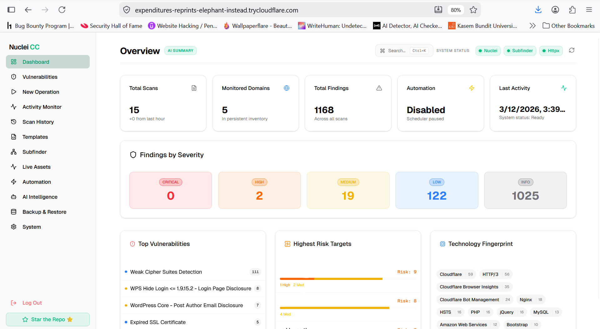

### 🧪 Vulnerability Management
| Vulnerabilities Feed | Scan Wizard |
|:---:|:---:|
| 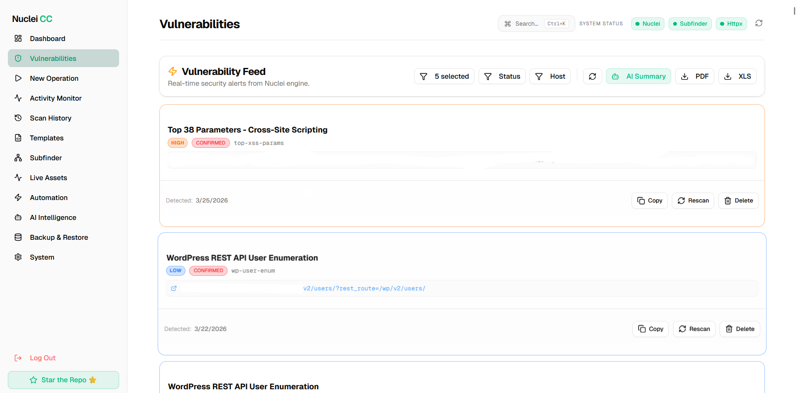 | 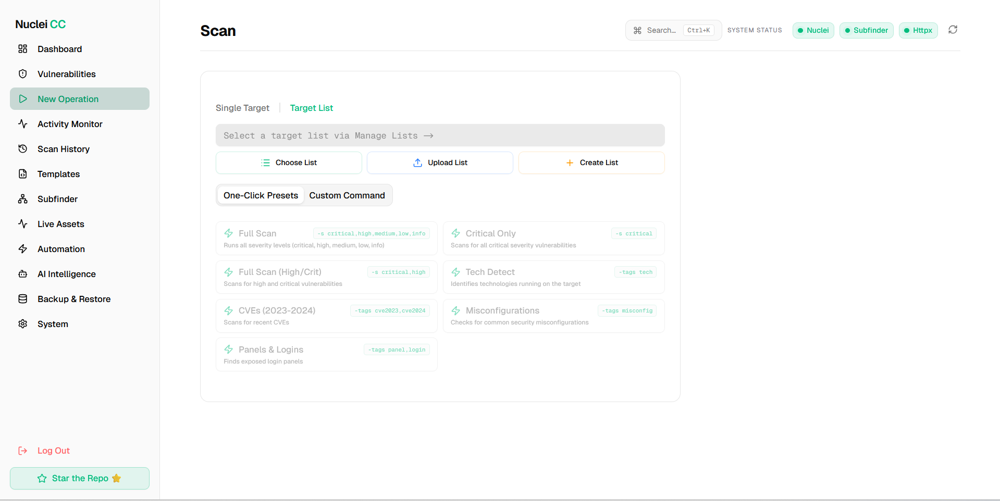 |

| Activity Monitor | Scan History |
|:---:|:---:|
| 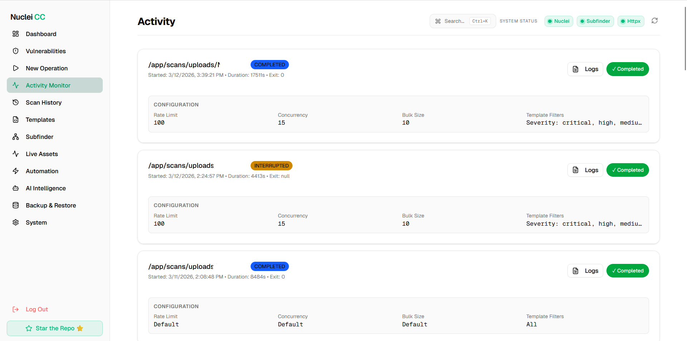 | 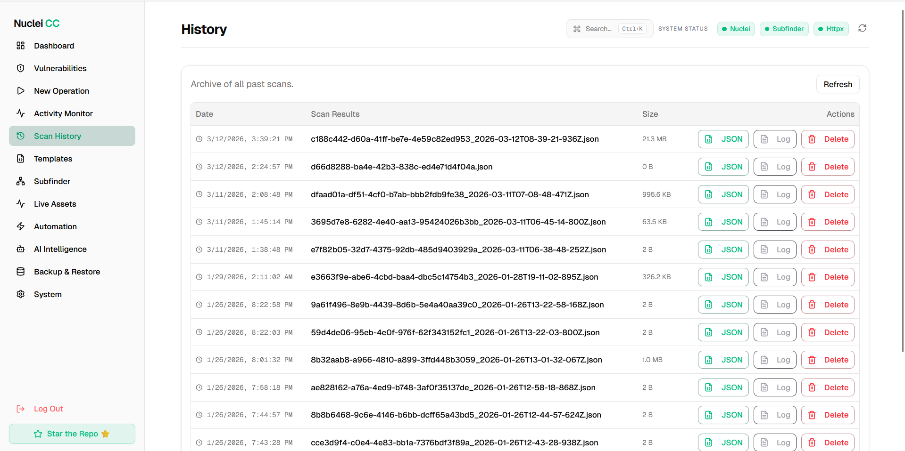 |

### 🤖 Agentic AI Intelligence
| AI Chat Interface | Tech Stack Analysis |
|:---:|:---:|
| 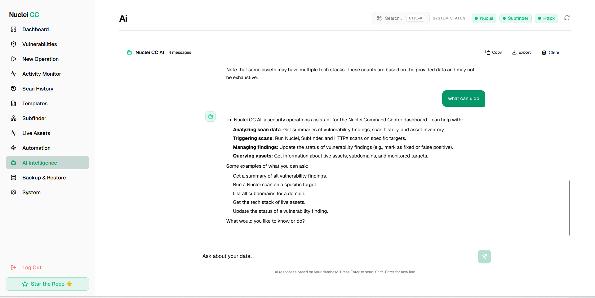 | 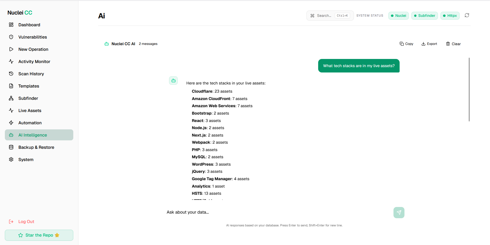 |

### 🔍 Asset Inventory & Probing
| Live Asset Probing | Asset Detail (Shodan) |
|:---:|:---:|
| 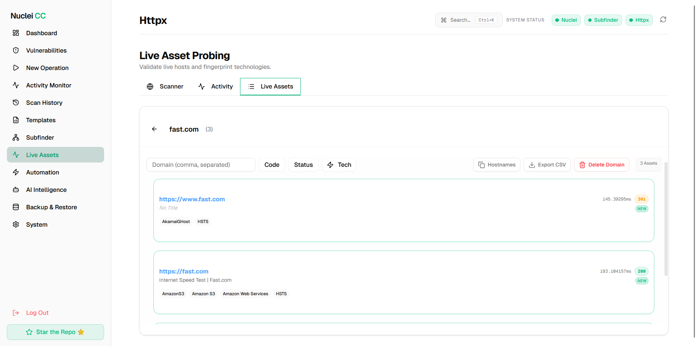 | 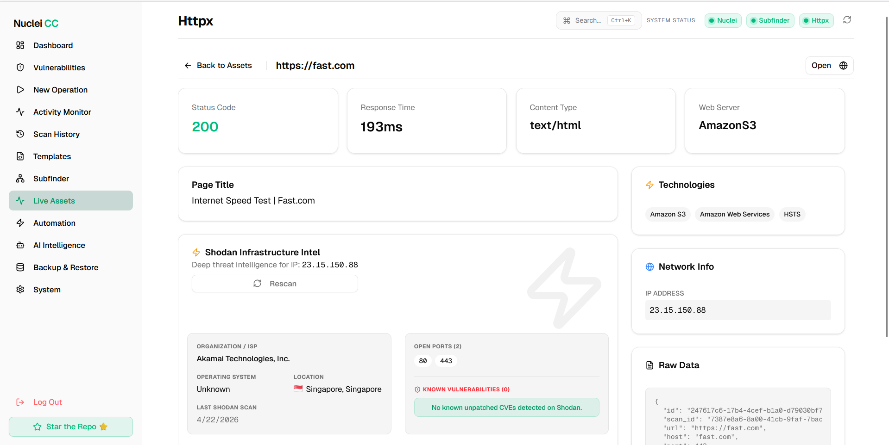 |

| Subfinder Scanner | Subdomains List |
|:---:|:---:|
| 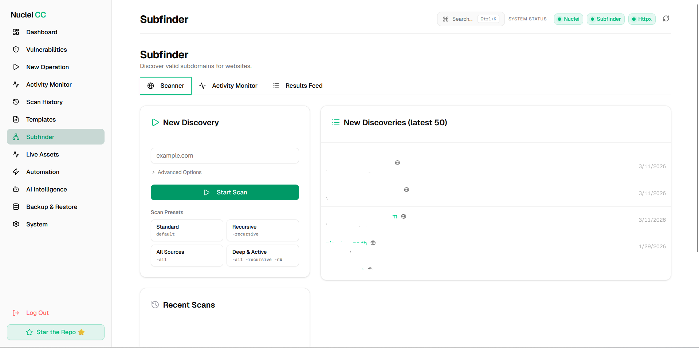 | 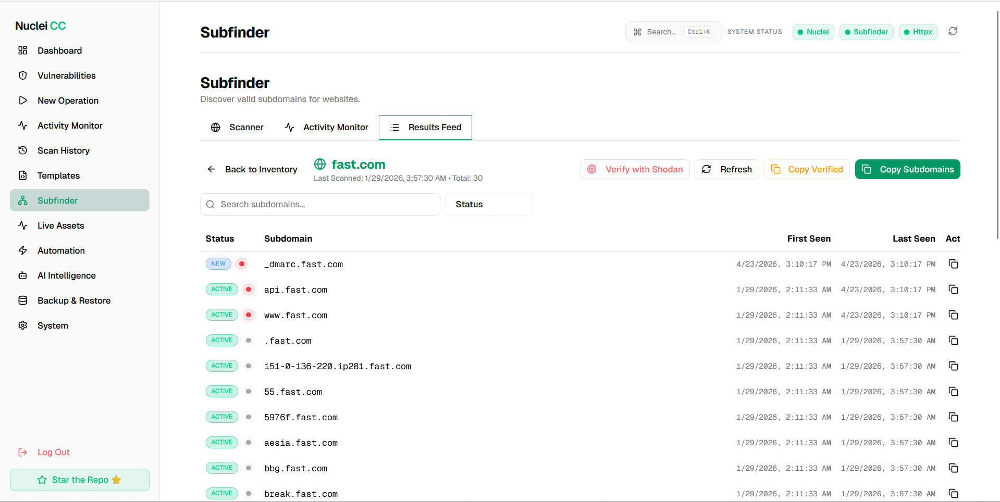 |

### ⚙️ Automation & System
| Automation Scheduler | Security Audit Log |
|:---:|:---:|
| 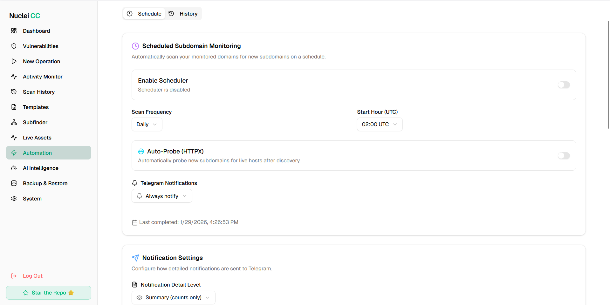 | 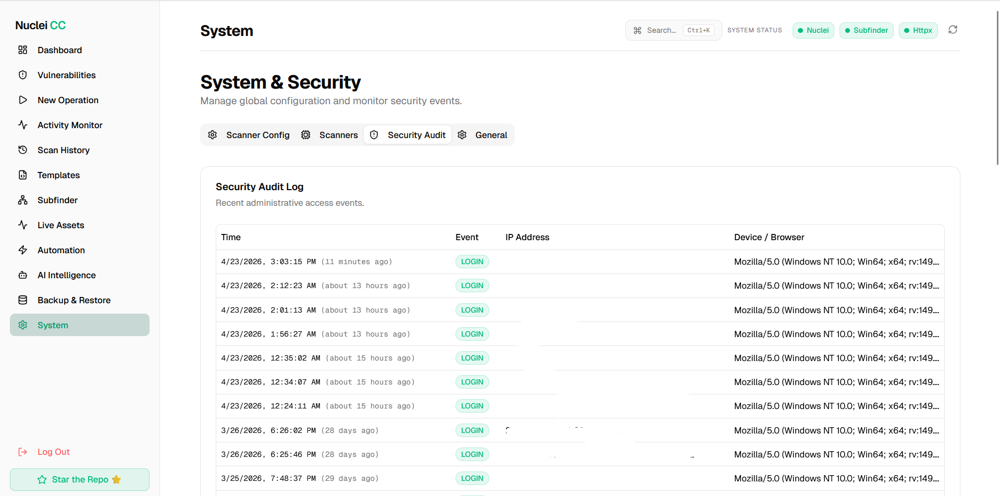 |

| Backup & Restore | Scanner Management |
|:---:|:---:|
| 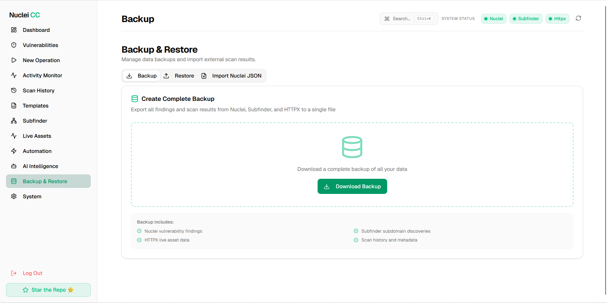 | 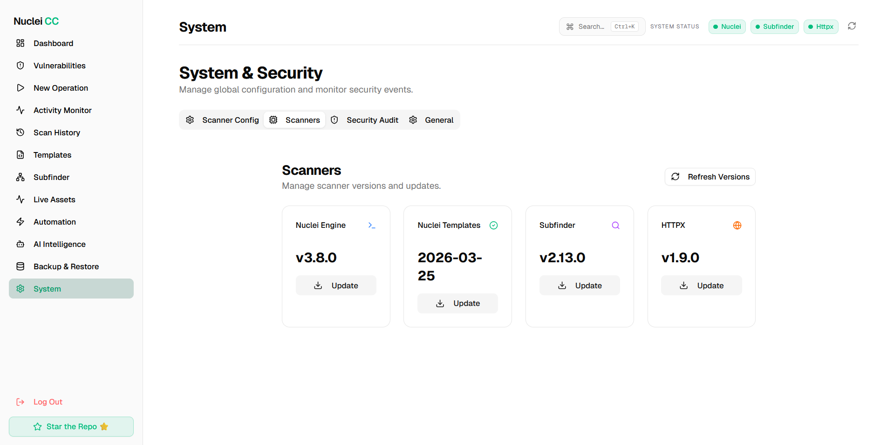 |

| Scanner Settings | General Settings |
|:---:|:---:|
| 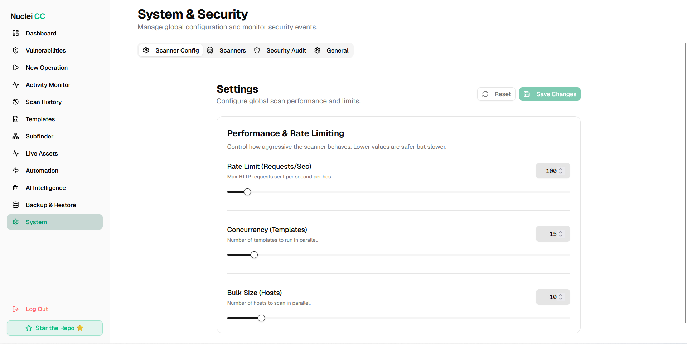 | 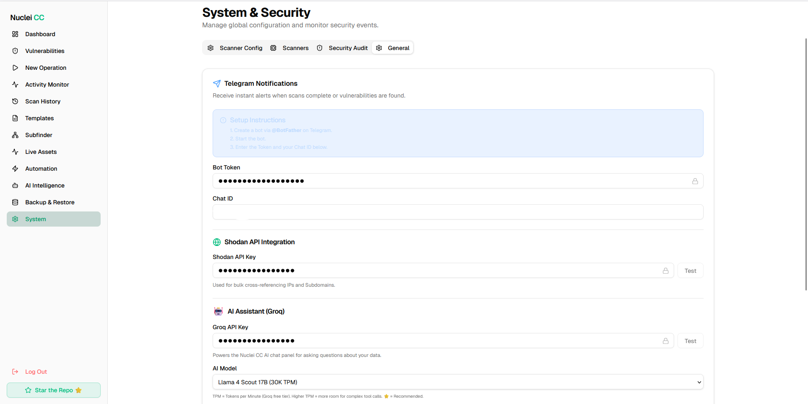 |

---

## Features

### 🎯 Core Scanning

| Tool | Capabilities |
|------|--------------|
| **Nuclei** | 7 preset modes (Full, Critical, CVEs, Tech Detection, etc.) + custom CLI builder |
| **Subfinder** | Subdomain enumeration with persistent inventory |
| **HTTPX** | HTTP probing for live host detection with technology fingerprinting |
| **Agentic AI** | Ask questions about your vulnerabilities and scans in natural language (Powered by Groq Llama-3) |

### 🧠 Full-Page AI Intelligence

Turn standard vulnerability management into an interactive data conversation:
- **Advanced Dynamic Search:** Ask the AI to filter with complex combinations (e.g., *"Show me all subdomains that include 'api' but except 'staging'"*). The AI natively injects exact parameterized SQL queries.
- **Natural Language to SQL:** For complex aggregations, the AI understands your SQLite schema and can execute raw, read-only analytics queries on the fly.
- **Large Dataset Export:** If you ask the AI to retrieve thousands of assets, it won't crash your browser. It automatically detects massive payloads, summarizes the first 5 rows, and generates a one-click **Download CSV** button.
- **Persistent Memory:** Draft inputs are saved to local storage, ensuring you never lose a prompt if you accidentally refresh or navigate away.
- **Markdown Tables & Per-Message Actions:** Seamless rendering of data tables, with one-click actions to Copy, Retry, or Delete specific messages in your conversation history.

### 📊 Vulnerability Management

- **Unified Finding Feed** - All scan results in one filterable, searchable interface
- **Status Workflow** - Track findings: New → Confirmed → False Positive → Fixed → Closed
- **Regression Detection** - Auto-detect when fixed vulnerabilities reappear (with Telegram alerts)
- **Surgical Rescan** - Re-verify individual findings with one click
- **Bulk Export** - CSV exports filtered by severity level

### ⏰ Scheduled Automation

- **Automated Monitoring** - Schedule subdomain discovery (6h / 12h / 24h / weekly)
- **Auto-Probe** - HTTPX automatically scans newly discovered subdomains
- **Auto-Nuclei** - Vulnerability scanning on new live hosts (with safety threshold)
- **Per-Domain Control** - Enable/disable scheduler and Nuclei per target
- **Automation History** - Full log of all scheduled runs with timestamps, domains, new subdomains, live hosts, and findings count

### 🔔 Notifications & Alerts

- **Telegram Integration** - Instant alerts for scan completion and regressions
- **Notification Detail Level** - Choose between:
  - **Summary Only** (recommended) - Counts only, no sensitive data in chat
  - **Detailed** - Includes subdomain/host names (with security warning)

### �️ Data Management

- **Full Backup/Restore** - Export all data (Nuclei, Subfinder, HTTPX) to JSON
- **Scheduled Backups** - Daily automatic backups with destination choice:
  - **Local Storage** - Save to `/data/backups/` (default)
  - **Telegram** - Off-site backup for disaster recovery (with security warning)
- **External Import** - Ingest Nuclei JSON from CI/CD pipelines or other tools

### ⚙️ System Administration

- **Scanner Updates** - One-click binary updates for Nuclei, Subfinder, HTTPX
- **Custom Templates** - Create, edit, and persist custom YAML templates
- **Performance Tuning** - Configurable rate limits, concurrency, and bulk sizes
- **Access Logging** - Audit trail for all authentication events

### ⌨️ Keyboard Shortcuts

- **Command Palette** (`Ctrl+K`) - Fuzzy search across views, actions, and navigation
- **Help Overlay** (`?`) - Full keyboard shortcut reference
- **Quick Navigation** (`g` + key) - Gmail/GitHub-style two-key combos (e.g., `g d` → Dashboard, `g v` → Vulnerabilities)
- **Global Shortcuts** - `/` focus search, `r` refresh, `n` new scan, `Esc` close modals

### 📺 Fullscreen Log Viewer

- **Always Fullscreen** - Immersive terminal-style log viewing
- **ANSI Color Rendering** - Full color support with inline CSS (XSS-safe)
- **Severity Detection** - Color-coded borders for Critical/High/Medium/Low/Info lines
- **Search** (`Ctrl+F`) - In-log search with match navigation (`Enter` / `Shift+Enter`)
- **Quick Actions** - `Ctrl+C` copy, `Ctrl+Shift+S` download, `Home`/`End` jump, `m` toggle nav
- **Integrated Navigation** - Slide-out sidebar menu to switch views without closing logs

---

## Architecture

```
┌─────────────────────────────────────────────────────────────────────────────────┐
│                             NUCLEI COMMAND CENTER                               │
├─────────────────────────────────────────────────────────────────────────────────┤
│                                                                                 │
│  ┌─────────────┐       ┌─────────────────┐       ┌────────────────────────┐     │
│  │   Browser   │◀─────▶│  Next.js (SSR)  │◀─────▶│    Agentic AI (Groq)   │     │
│  │   Client    │       │   App Router    │       │    (Llama-3/Llama-4)   │     │
│  └─────────────┘       └────────┬────────┘       └────────────────────────┘     │
│         ▲                       │                            ▲                  │
│         │              ┌────────▼────────┐                   │                  │
│         │              │  Auth.js (v5)   │                   │                  │
│         │              │  Session Mgmt   │                   │                  │
│         │              └────────┬────────┘                   │                  │
│         │                       │                            │                  │
│  ┌──────▼──────┐       ┌────────▼────────┐          ┌────────▼────────┐         │
│  │    React    │◀─────▶│   API Routes    │◀────────▶│  SQLite (WAL)   │         │
│  │  Components │       │   (/api/*)      │          │   (Persistence) │         │
│  └─────────────┘       └────────┬────────┘          └────────┬────────┘         │
│                                 │                            │                  │
│                ┌────────────────▼────────────────┐           │                  │
│                │      Binary Execution Layer     │◀──────────┘                  │
│                │     (child_process spawning)    │                              │
│                └────┬───────────┬───────────┬────┘                              │
│                     │           │           │                                   │
│              ┌──────▼─────┐┌────▼────┐┌─────▼──────┐      ┌─────────────┐       │
│              │   Nuclei   ││Subfinder││   HTTPX    │◀────▶│  Shodan API │       │
│              │  (Scans)   ││ (Enum)  ││ (Probing)  │      └─────────────┘       │
│              └──────┬─────┘└─────────┘└────────────┘                            │
│                     │                                     ┌─────────────┐       │
│                     └────────────────────────────────────▶│  Telegram   │       │
│                                                           │ (Alerting)  │       │
│                                                           └─────────────┘       │
└─────────────────────────────────────────────────────────────────────────────────┘
```


### Technology Stack

| Layer | Technology | Purpose |
|-------|------------|---------|
| **Frontend** | Next.js 16, React 19, Tailwind CSS v4 | Server-side rendering, responsive UI |
| **Agentic AI** | Groq (Llama-3 / Llama-4 Scout) | Intelligent data analysis & tool orchestration |
| **Authentication** | Auth.js v5 (NextAuth) | Session management, middleware protection |
| **Database** | SQLite + better-sqlite3 | Embedded, zero-config persistence (WAL mode) |
| **Core Binaries** | Nuclei, Subfinder, HTTPX | Security scanning, discovery, and probing |
| **Integrations** | Shodan API, Telegram Bot | Infrastructure intel & real-time alerting |
| **Deployment** | Docker & Cloudflare Tunnel | Isolated execution & secure remote access |

---

## 🚀 Installation & Deployment

**We strongly recommend using Docker.** Our official image is **multi-platform**, meaning it runs natively on:
- 🖥️ **linux/amd64** (Intel/AMD Servers, Cloud VMs)
- 🍓 **linux/arm64** (Raspberry Pi, Apple Silicon M1/M2/M3, AWS Graviton)

It allows you to run the full vulnerability dashboard without installing Node.js, Go, or configuring complex dependencies manually.

### Prerequisites
1.  **Docker Desktop** (running).
2.  **Python 3** (for quick start script) - *optional but recommended*


### Method 1: Docker Compose (Recommended)

**Step 1:** Create a project folder:
```bash
mkdir nuclei-cnm
cd nuclei-cnm
```

**Step 2:** Create `docker-compose.yml`:

> **Easier Option:** [Download this file from GitHub](https://github.com/devtint/NUCLEI_CNM/blob/main/docker-compose.yml) and save it as `docker-compose.yml`.

Or copy this exact content - it is production ready & includes Cloudflare Tunnel:

```yaml
services:
  nuclei-cnm:
    image: mrtintnaingwin/nucleicnm:latest
    # Uncomment below if you want to build from source instead of pulling image
    # build: ./dashboard
    container_name: nuclei-command-center
    ports:
      - "3000:3000"
    volumes:
      - nuclei_data:/app/data
      - nuclei_scans:/app/scans
      - nuclei_templates:/home/nextjs/nuclei-templates
      - nuclei_custom_templates:/home/nextjs/nuclei-custom-templates
    environment:
      - NODE_ENV=production
      - DATABASE_PATH=/app/data/nuclei.db
    restart: unless-stopped
    # Resource limits: prevent nuclei scans from starving dashboard + tunnel
    # Override at runtime via env vars: CNM_CPU_LIMIT, CNM_MEM_LIMIT
    deploy:
      resources:
        limits:
          cpus: '${CNM_CPU_LIMIT:-2.0}'
          memory: ${CNM_MEM_LIMIT:-2G}
        reservations:
          cpus: '0.5'
          memory: 512M
    # If OOM occurs, kill this container first (not cloudflared)
    oom_score_adj: 500
    healthcheck:
      test: [ "CMD", "wget", "-q", "--spider", "http://localhost:3000/login" ]
      interval: 30s
      timeout: 10s
      retries: 3
      start_period: 40s

  cloudflared:
    image: cloudflare/cloudflared:latest
    container_name: nuclei-cnm-tunnel
    command: tunnel --no-autoupdate --url http://nuclei-cnm:3000
    depends_on:
      nuclei-cnm:
        condition: service_healthy
    restart: unless-stopped
    # Protect tunnel: low resource needs, high OOM survival priority
    deploy:
      resources:
        limits:
          cpus: '0.25'
          memory: 128M
        reservations:
          cpus: '0.1'
          memory: 64M
    oom_score_adj: -500

volumes:
  nuclei_data:
  nuclei_scans:
  nuclei_templates:
  nuclei_custom_templates:
```

**Step 3:** Start the application:
```bash
docker compose down      # Stop any existing containers
docker compose pull      # Pull the latest image
docker compose up -d     # Start the application
```
*Wait ~30 seconds for the database to initialize.*

> [!IMPORTANT]
> ### 🛑 First Run: Permission Errors?
>
> If you see **"no templates provided"** or **cannot save custom templates**, your volume permissions are incorrect.
>
> **The Quick Start Script (`python start-nuclei.py`) checks and fixes this automatically.**
>
> If running manually and you see these errors:
> ```bash
> docker exec -u 0 nuclei-command-center chown -R nextjs:nodejs /home/nextjs/nuclei-templates /home/nextjs/nuclei-custom-templates
> ```
>
> **Then Download Templates:**
> ```bash
> docker exec nuclei-command-center nuclei -ut
> ```
> *Or click "Update" in the System > Scanners dashboard.*

**Step 4:** Get your HTTPS URL (Cloudflare Tunnel)
```bash
docker compose logs -f cloudflared
```
You will see a URL like: `https://silent-snowflake-9d2a.trycloudflare.com`

> **Note**: This URL changes if the container restarts.

**Step 5:** Finish Setup:
*   Open your **Cloudflare URL** (or `http://localhost:3000` if on the same machine)
*   Follow the **Setup Wizard** to create your admin password.

---

### 🏠 Localhost Only (No Tunnel)

If you do **NOT** want public access:

> [Download `docker-compose.local.yml`](https://github.com/devtint/NUCLEI_CNM/blob/main/docker-compose.local.yml), rename it to `docker-compose.yml`, and run `docker compose up -d`.

---

### Method 2: One-Line Command (Quick Test)

```bash
docker run -d \
  --name nuclei-cnm \
  -p 3000:3000 \
  -v nuclei_data:/app/data \
  -v nuclei_scans:/app/scans \
  mrtintnaingwin/nucleicnm:latest
```

---

### Alternative: Build from Source

For developer contributors, see the **[Manual Installation Guide](MANUAL_INSTALL.md)**.

---

## 🛠 Maintenance

### How to Update
```bash
docker compose down
docker compose pull
docker compose up -d
```

### Data Persistence
We use **Docker Named Volumes** (`nuclei_data`, `nuclei_scans`, `nuclei_custom_templates`). Your data survives container updates.

- **Backup Data**: `docker cp nuclei-command-center:/app/data/nuclei.db ./nuclei.db`
- **List Scans**: `docker exec nuclei-command-center ls -l /app/scans`

---

## Security

### Authentication Architecture

```
┌──────────────────────────────────────────────────────────────┐
│                    Security Layers                           │
├──────────────────────────────────────────────────────────────┤
│  Layer 1: Edge Middleware (proxy.ts)                        │
│  ├─ Intercepts ALL requests before routing                  │
│  ├─ Validates session existence                             │
│  └─ Redirects unauthenticated users to /login               │
│                                                              │
│  Layer 2: API Route Guards                                   │
│  ├─ Every API handler calls await auth()                    │
│  └─ Returns 401 Unauthorized if no session                  │
│                                                              │
│  Layer 3: Password Security                                  │
│  ├─ Bcrypt hashing with 10 salt rounds                      │
│  └─ No plaintext password storage                           │
│                                                              │
│  Layer 4: Session Management                                 │
│  ├─ Secure HTTP-only cookies                                │
│  └─ CSRF protection (built-in)                              │
└──────────────────────────────────────────────────────────────┘
```

### Security Best Practices

| Practice | Implementation |
|----------|----------------|
| **Secrets Management** | All secrets in `.env.local` (gitignored) |
| **SQL Injection** | Prepared statements via better-sqlite3 |
| **XSS Prevention** | React's built-in escaping + CSP headers |
| **CSRF Protection** | NextAuth automatic token validation |
| **Access Logging** | Authentication events logged to database |

---

## Configuration

### Environment Variables

| Variable | Required | Description |
|----------|----------|-------------|
| `ADMIN_PASSWORD_HASH` | ❌ | **Auto-configured via setup wizard** |
| `AUTH_SECRET` | ❌ | **Auto-generated via setup wizard** |
| `DATABASE_PATH` | ❌ | Custom database location (default: `/app/data/nuclei.db`) |
| `GROQ_API_KEY` | ❌ | API key from [Groq](https://console.groq.com/keys) to enable the AI Chat Assistant (can also be set in UI Settings) |
| `SHODAN_API_KEY` | ❌ | Shodan API Key for OSINT enrichment (can also be set in UI Settings) |

> **Docker Note**: Password and auth secret are configured via the first-run setup wizard. No manual config required!

### Performance Tuning

Located in **Settings** within the dashboard:

| Setting | Default | Range | Impact |
|---------|---------|-------|--------|
| Rate Limit | 150 req/s | 50-1000 | Target server load |
| Concurrency | 25 | 25-300 | Parallel template execution |
| Bulk Size | 25 | 25-100 | Hosts per batch |

---

## Project Structure

```
NUCLEI_CNM/
├── dashboard/                          # Next.js Application
│   ├── app/                            # App Router
│   │   ├── api/                        # Backend API Routes
│   │   │   ├── auth/                   # NextAuth endpoints
│   │   │   ├── scan/                   # Scan CRUD operations
│   │   │   ├── findings/               # Finding management
│   │   │   ├── scheduler/              # Scheduled scan settings
│   │   │   ├── backup/                 # Export/restore
│   │   │   └── system/                 # Engine updates, health
│   │   ├── login/                      # Authentication page
│   │   └── page.tsx                    # Main dashboard
│   ├── components/                     # React Components
│   │   ├── dashboard/                  # Overview, stats, analysis
│   │   ├── findings/                   # Table, filters, export
│   │   ├── layout/                     # Sidebar, CommandPalette, ShortcutHelp, KeyboardShortcuts
│   │   ├── scan/                       # Wizard, LiveConsole, LogViewer
│   │   ├── subfinder/                  # SubfinderPanel, SubdomainTable, ResultsFeed
│   │   ├── httpx/                      # HttpxPanel (live asset probing)
│   │   ├── system/                     # Settings, Scheduler, Scanners, Config
│   │   ├── templates/                  # Template manager and list
│   │   ├── import/                     # Backup & restore panel
│   │   └── ui/                         # shadcn/ui primitives
│   ├── lib/                            # Core Logic
│   │   ├── db.ts                       # Database operations (1000+ lines)
│   │   ├── ansi.ts                     # ANSI color → HTML converter (XSS-safe)
│   │   ├── scheduler.ts                # Scheduled scan logic
│   │   ├── notifications.ts            # Telegram integration
│   │   └── nuclei/                     # Config, presets
│   ├── scripts/                        # Utility scripts
│   │   ├── init-config.js              # Docker first-run config generator
│   │   └── hash-password.js            # Password hash utility
│   └── proxy.ts                        # Authentication middleware
├── docker-compose.yml                  # Production (with Cloudflare Tunnel)
├── docker-compose.local.yml            # Local-only (no tunnel)
├── Reference and Usage And Guide/      # Technical Documentation
└── README.md                           # This file
```

---

## Documentation

| Document | Description |
|----------|-------------|
| [GETTING_STARTED.md](./Refrencce%20and%20Usage%20And%20Guide/GETTING_STARTED.md) | Complete setup and first scan guide |
| [AUTHENTICATION.md](./Refrencce%20and%20Usage%20And%20Guide/AUTHENTICATION.md) | Security implementation details |
| [ARCHITECTURE.md](./Refrencce%20and%20Usage%20And%20Guide/ARCHITECTURE.md) | System design and data flow |
| [API_REFERENCE.md](./Refrencce%20and%20Usage%20And%20Guide/API_REFERENCE.md) | Endpoint specifications |
| [DATABASE_SCHEMA.md](./Refrencce%20and%20Usage%20And%20Guide/DATABASE_SCHEMA.md) | SQLite table definitions and relationships |

---

## Contributing

1. Fork the repository
2. Create a feature branch (`git checkout -b feature/enhancement`)
3. Commit changes (`git commit -m 'feat: add new capability'`)
4. Push to branch (`git push origin feature/enhancement`)
5. Open a Pull Request

### Commit Convention

This project follows [Conventional Commits](https://www.conventionalcommits.org/):
- `feat:` New feature
- `fix:` Bug fix
- `docs:` Documentation
- `security:` Security improvements

---

## License

This project is licensed under the **MIT License**. See [LICENSE](./LICENSE) for details.

Nuclei is a product of [ProjectDiscovery](https://projectdiscovery.io/) and is also licensed under the [MIT License](https://github.com/projectdiscovery/nuclei/blob/master/LICENSE).

---

## Acknowledgments

- [ProjectDiscovery](https://projectdiscovery.io/) for Nuclei, Subfinder, and HTTPX
- [Vercel](https://vercel.com/) for Next.js
- [shadcn](https://ui.shadcn.com/) for the UI component library
- [Auth.js](https://authjs.dev/) for authentication primitives

---

<p align="center">
  <strong>Built with 🔐 Security in Mind</strong>
</p>
